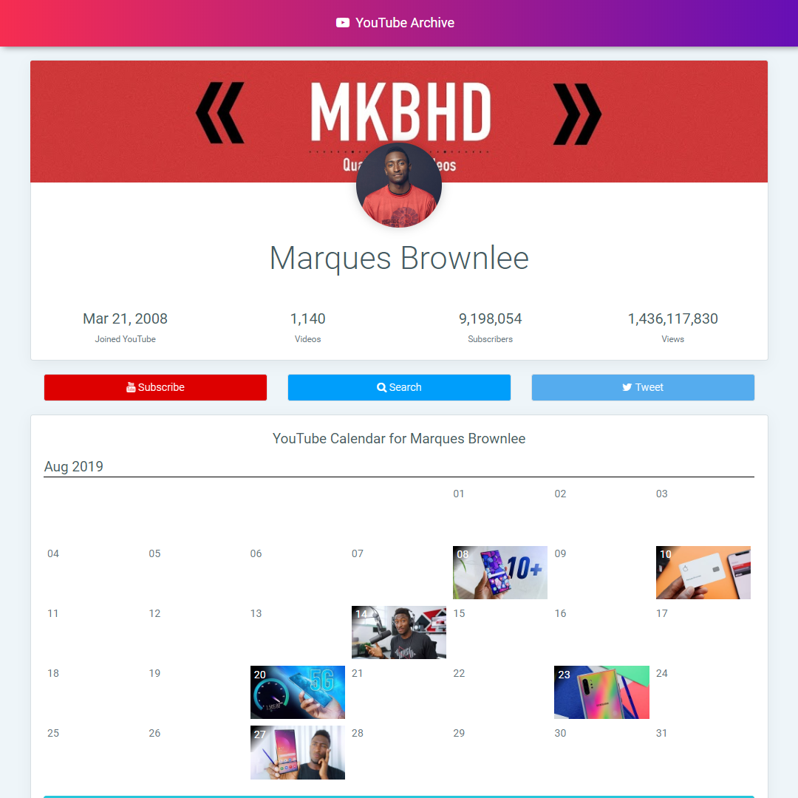

# YouTube Archive

YouTube Archive displays all the videos from any YouTuber in Calendar format,which can be really useful for people who post videos everyday like vloggers.YouTube Archive loads up to 100 videos each month and displays them.

This tool was inspired by a website which showcased Casey's daily vlogs in a similar format and I felt this should be a tool for any YouTuber without questions and made YouTube Archive.

You can directly bookmark the relevant page to directly jump to a specific user. Sharing features are built right into the web app.

 
*YouTube Archive showing MKBHD*

Feel free to submit issues/pull request if you'd like to contribute.

# Try it yourself!

* [Casey Neistat](https://akshatmittal.com/youtube-archive/#!/UCtinbF-Q-fVthA0qrFQTgXQ "Casey Neistat's YouTube Archive")
* [Marques Brownlee](https://akshatmittal.com/youtube-archive/#!/UCBJycsmduvYEL83R_U4JriQ "Marques Brownlee's YouTube Archive")

# Support

If you would like to support this project, please consider donating via [PayPal](https://paypal.me/AkshatMittal/5USD) or [Instamojo (India)](https://imjo.in/26KdPa) to keep this tool free!

# License

YouTube Realtime Copyright (C) 2019 [Akshat Mittal](https://akshatmittal.com/)

You may freely modify the code for personal use. You are not allowed to redistribute the project without attribution and credits or prior permission. Commercial use without permission is prohibited.

This project uses a part of code from WrapPixel.

# Disclaimer

The project forks and code by default redirects back to this repo. You can view the instructions to modify the code [here](https://github.com/akshatmittal/youtube-realtime/issues/14#issuecomment-247537299).

The code is absolutely terrible, has mixed ES5 and ES6 methods primarily because it was created within a few hours with [YouTube Realtime](https://akshatmittal.com/youtube-realtime/)'s source as base (which is over 3 years old now).